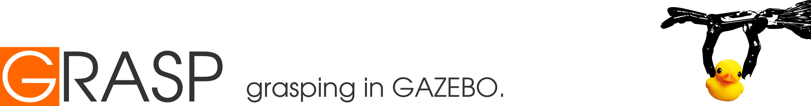

<p align="center"> 
	
</p>

--------------------

GRASP is a set of tools for dynamic grasp simulation within [Gazebo] using [DART] physics engine.
It supports both parallel-plate grippers and multi-fingered hands, namely with underactuated joints.

<p align="center"> 
<center>
<table>
  <tr>
  <td width="33%"></td>
  <td width="33%"></td>
  <td width="33%"></td>
  </tr>
  </table>
</center>
</p>

### Setup environment and dependencies

Refer to [setup]. 

### Compilation

Clone the repository to your workspace directory and build from source.

```bash
cd ~/workspace/grasp/ && mkdir build && cd build && cmake ../ && make -j8
```

### Initialisation

Make sure you properly initialise the required environment variables.
We provide a simple script for this:

```bash
cd ~/workspace/grasp && source setup.sh
```

### Examples

Check the provided [examples].

### Documentation

Take a look at the automatic [documentation] for file and class description.


[DART]: https://dartsim.github.io/
[documentation]: http://web.tecnico.ulisboa.pt/joao.borrego/grasp/
[examples]: examples
[Gazebo]: http://gazebosim.org/
[setup]: deps/setup.md
